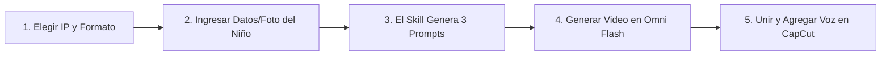

<div align="center">

[简体中文](README.md) · [English](README.en.md) · [日本語](README.ja.md) · [한국어](README.ko.md) · [**Español**](README.es.md)

# 🎂 Kid Papercraft (Generador de Videos de Cumpleaños en Origami para Niños)

### Convierte el cumpleaños de cualquier niño en un mágico video de origami stop-motion de 30 segundos con populares héroes de animación.

Un Skill de IA de código abierto para creadores y familias. Ingresa el nombre, edad, foto o descripción del niño para generar 3 escenas de stop-motion optimizadas para **Gemini Omni Flash** con guiones de locución incluidos.


Ideal para: **Saludos de cumpleaños personalizados, celebraciones familiares, videos cortos para TikTok / Instagram Reels / YouTube Shorts**.

</div>

---

## ⚠️ Descargo de Responsabilidad y Derechos de PI (Disclaimer)

1. **Proyecto No Oficial**: Este repositorio de código abierto (`kid-papercraft`) proporciona plantillas de ingeniería de prompts y habilidades de flujo de trabajo. **Es un proyecto independiente sin afiliación, patrocinio ni respaldo de ningún estudio de animación o titular de marca**.
2. **Propiedad Intelectual**: Todos los personajes animados, marcas registradas y nombres (incluidos Bob Esponja, Peppa Pig, Ultraman, Paw Patrol, Doraemon, etc.) pertenecen a sus respectivos creadores y titulares de derechos de autor.
3. **Uso Permitido**: Las plantillas se proporcionan exclusivamente para estudio personal, investigación tecnológica, exploración artística y **videos de felicitación familiar de carácter no comercial**.

---

## ✨ Características Principales

- 🎭 **5 Mundos Animados en Origami**: Bob Esponja, Peppa Pig, Ultraman, Paw Patrol y Doraemon con estética de papel artesanal.
- ⏱️ **Estructura Narrativa de 3 Actos (30 Segundos = 3 Clips de 10s)**:
  - **Acto 1 (0–10s) Entrada Creativa**: Los personajes salen de escenarios de papel doblado con divertidas animaciones.
  - **Acto 2 (10–20s) Celebración de Cumpleaños**: Los personajes sostienen un pastel brillante y un cartel con el avatar de origami del niño.
  - **Acto 3 (20–30s) Buenos Hábitos con Amor**: Animaciones tiernas recordando cepillarse los dientes 🪥, dormir a tiempo 😴 y comer sano 🍽️.
- 👶 **Avatar Personalizado del Niño**: Admite descripciones físicas y fotos como Reference Image (Imagen de Referencia).
- 📐 **Formatos Adaptables**: `9:16` (Vertical para Shorts/Reels/TikTok) y `16:9` (Horizontal para TV/Tablets).
- 🎙️ **Guiones de Voz y Subtítulos**: Textos adaptados a la personalidad de cada personaje para la edición final.

---

## 🎬 5 Franquicias de Animación Compatibles

| # | Caricatura / IP | Personajes Principales | Escenario de Origami |
|:---:|:---|:---|:---|
| 🧽 | **Bob Esponja** | Bob Esponja y Patricio | Casa de Piña de Fondo de Bikini y arrecifes de papel |
| 🐷 | **Peppa Pig** | Peppa y George | Colinas de hierba y charcos de barro de papel |
| ⭐ | **Ultraman** | Héroe Chibi y pequeño monstruo amigo | Ciudad miniatura de papel al atardecer |
| 🐶 | **Paw Patrol** | Chase y Marshall | Plaza del pueblo de rescate y caseta de papel |
| 🤖 | **Doraemon** | Doraemon y Nobita | Habitación acogedora con inventos mágicos de papel |

---

## 🛠️ Flujo de Trabajo (Workflow)



---

## 📦 Instalación y Uso

```bash
git clone https://github.com/kaomei/kid-papercraft.git
cd kid-papercraft

# Para Antigravity / Gemini CLI
cp -R skills/kid-papercraft ~/.gemini/config/skills/kid_papercraft

# Para Codex CLI
cp -R skills/kid-papercraft "${CODEX_HOME:-$HOME/.codex}/skills/kid_papercraft"
```

Invocar en la conversación:
```text
¡Ayúdame a crear un video de cumpleaños en origami para mi hijo!
```

---

## 📄 Licencia

[MIT License](LICENSE) © 2026 [kaomei](https://github.com/kaomei)
