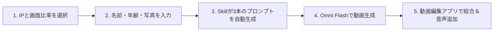

<div align="center">

[简体中文](README.md) · [English](README.en.md) · [**日本語**](README.ja.md) · [한국어](README.ko.md) · [Español](README.es.md)

# 🎂 Kid Papercraft (子ども向け折り紙風コマ撮り誕生日動画生成器)

### 大人気アニメヒーローと一緒に、温もりと魔法に満ちた30秒の折り紙コマ撮り誕生日ムービーを作成。

クリエイターと保護者のためのオープンソース AI Skill。子どもの名前、年齢、写真、または外見の特徴を入力するだけで、**Gemini Omni Flash** モデルに対応した3部構成のコマ撮りアニメーションプロンプトと日本語/中国語対応のボイスオーバー台本を生成します。


適用シーン：**子どもの誕生日サプライズ、家族のお祝い、TikTok / YouTube Shorts / Instagram リール用ショート動画**。

</div>

---

## ⚠️ 免責事項および著作権に関するお知らせ (Disclaimer)

1. **非公式プロジェクト**：本プロジェクト（`kid-papercraft`）はオープンソースのプロンプト設計ツールであり、**記載されているアニメ制作会社、版権元、公式ブランドとは一切の提携・後援関係はありません**。
2. **知的財産権の帰属**：言及されているすべてのキャラクター（スポンジ・ボブ、ペッパピッグ、ウルトラマン、パウ・パトロール、ドラえもん等）の商標および著作権は、それぞれの権利所有者に帰属します。
3. **利用範囲**：生成されたプロンプトは個人の学習、研究、AI生成アートの探求、および**非営利目的の家庭内バースデー動画作成**にのみご利用ください。商用利用に伴う責任は利用者が負うものとします。

---

## ✨ 主な特徴

- 🎭 **5大人気アニメの世界観を折り紙化**：スポンジ・ボブ、ペッパピッグ、ウルトラマン、パウ・パトロール、ドラえもんの手作りペーパークラフト質感。
- ⏱️ **30秒の黄金3幕構成（10秒 × 3クリップ）**：
  - **第1幕（0–10秒）ユニークな登場**：キャラクターたちが飛び出す絵本のように楽しく登場。
  - **第2幕（10–20秒）バースデーセレブレーション**：キャンドルが灯るケーキとバナーを囲み、お子さまの折り紙キャラクターと一緒に祝福。
  - **第3幕（20–30秒）心温まる生活習慣メッセージ**：歯磨き 🪥、おやすみ 😴、ご飯をもぐもぐ 🍽️ の可愛いショートアニメ。
- 👶 **オリジナル折り紙アバター**：お子さまの特徴を反映し、Reference Image（参考画像）のアップロードにも対応。
- 📐 **マルチアスペクト比**：`9:16`（縦型ショート動画）と `16:9`（横型テレビ・タブレット）に対応。
- 🎙️ **キャラクター音声・字幕台本付属**：各キャラクターの個性に合わせたセリフ付き。

---

## 🎬 対応する5大アニメIP

| # | アニメ IP | メインキャラクター | 折り紙シーンテーマ |
|:---:|:---|:---|:---|
| 🧽 | **スポンジ・ボブ** | スポンジ・ボブ & パトリック | 折り紙のパイナップルの家とサンゴ礁 |
| 🐷 | **ペッパピッグ** | ペッパ & ジョージ | 折り紙の芝生の丘と泥たまり |
| ⭐ | **ウルトラマン** | Q版ヒーロー & なかよし怪獣 | 夕焼けのミニチュア折り紙都市 |
| 🐶 | **パウ・パトロール** | チェイス & マーシャル | ミニ折り紙レスキュータウンと犬小屋 |
| 🤖 | **ドラえもん** | ドラえもん & のび太 | ひみつ道具がいっぱいの折り紙の子ども部屋 |

---

## 🛠️ 制作ワークフロー (Workflow)



---

## 📦 インストール方法

```bash
git clone https://github.com/kaomei/kid-papercraft.git
cd kid-papercraft

# Antigravity / Gemini CLI の場合
cp -R skills/kid-papercraft ~/.gemini/config/skills/kid_papercraft

# Codex CLI の場合
cp -R skills/kid-papercraft "${CODEX_HOME:-$HOME/.codex}/skills/kid_papercraft"
```

チャットで呼び出し：
```text
子どものために折り紙風の誕生日お祝い動画を作って！
```

---

## 📄 ライセンス

[MIT License](LICENSE) © 2026 [kaomei](https://github.com/kaomei)
